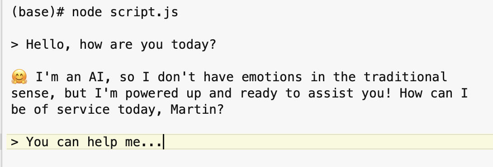
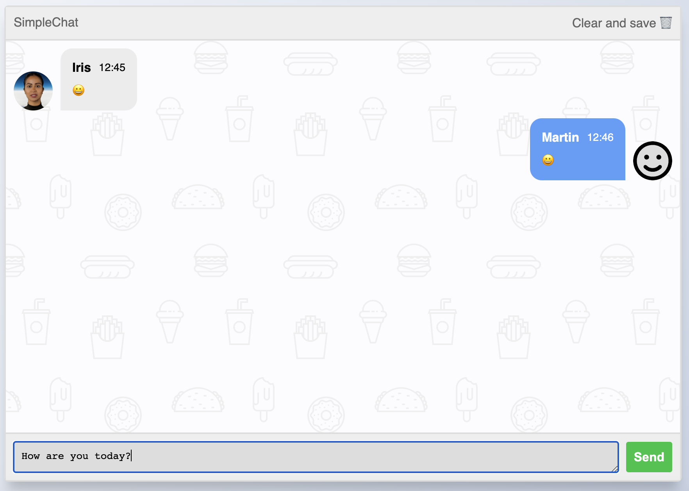

# INSTALLATION

npm install

(You have had to need NodeJs installed on your mac)

# CONFIGURATION

Open the .env file and change it.
Add your OPEN-API-KEY there!

# RUN
Two ways of usage are implemented.

## RUN in terminal (orignal way to chat)

```console
> node script.js
```




## RUN in Browser (second way to chat)

```console
> node server.js
```

Then click on http://localhost:3000/




